# Dokumentasi Proyek Aplikasi Ringkasan Buku Otomatis

Dokumentasi ini menjelaskan struktur direktori, logika sistem, desain UI, dan diagram kelas aplikasi berdasarkan kode sumber proyek.

---

## 1. STRUKTUR FOLDER/PROJECT

```text
ringkasan-buku/
├── src/
│   └── main/
│       ├── java/
│       │   └── com/
│       │       └── ringkasanbuku/
│       │           ├── App.java                   (Entry point aplikasi JavaFX, mengatur scene dan layout)
│       │           ├── controller/
│       │           │   ├── HistoryController.java (Controller untuk UI riwayat daftar ringkasan)
│       │           │   └── MainController.java    (Controller untuk UI utama dan alur logika proses ringkasan)
│       │           ├── exporter/
│       │           │   ├── FileExporter.java      (Interface untuk mengekspor hasil ke format file)
│       │           │   ├── PDFExporter.java       (Implementasi ekspor ke format PDF dengan PDFBox dan word-wrap)
│       │           │   └── TxtExporter.java       (Implementasi ekspor ke format teks biasa/.txt)
│       │           ├── model/
│       │           │   ├── Book.java              (Model data untuk merepresentasikan buku lengkap)
│       │           │   ├── Chapter.java           (Model data untuk merepresentasikan bab di dalam buku)
│       │           │   ├── Summary.java           (Model utama data riwayat/ringkasan yang mencatat hasil)
│       │           │   ├── SummaryLength.java     (Enum konfigurasi panjang ringkasan: SHORT, MEDIUM, LONG)
│       │           │   ├── SummaryOptions.java    (Model kelas pengatur opsi jenis dan panjang ringkasan)
│       │           │   └── SummaryStyle.java      (Enum gaya ringkasan: EXTRACTIVE, ABSTRACTIVE)
│       │           ├── repository/
│       │           │   └── HistoryRepository.java (Manajemen CRUD data riwayat ringkasan ke file JSON dengan Gson)
│       │           ├── summarizer/
│       │           │   ├── APIFallbackManager.java(Manajer untuk fallback ke API provider lain bila yang pertama gagal)
│       │           │   ├── GeminiSummarizer.java  (Implementasi peringkas dengan model Gemini Google)
│       │           │   ├── GroqSummarizer.java    (Implementasi peringkas dengan model dari API Groq)
│       │           │   ├── LLMSummarizer.java     (Abstract class untuk semua LLM API summarizer)
│       │           │   ├── OpenAISummarizer.java  (Implementasi peringkas dengan model GPT dari OpenAI)
│       │           │   ├── Summarizer.java        (Interface utama bagi algoritma dan API summarizer)
│       │           │   └── TFIDFSummarizer.java   (Implementasi peringkas rule-based (ekstraktif) algoritma TF-IDF)
│       │           └── util/
│       │               ├── EnvLoader.java         (Utilitas pembaca environment variables dari file .env)
│       │               └── TextChunker.java       (Pemecah teks menjadi potongan kecil dengan mekanisme overlap)
│       └── resources/
│           ├── .env                       (File environment lokal berisi API keys, diabaikan di Git)
│           ├── stopwords_id.txt           (Daftar kata stopwords bahasa Indonesia untuk algoritma TF-IDF)
│           └── fxml/
│               ├── history.fxml           (Definisi struktur UI berbasis XML untuk halaman riwayat)
│               └── main.fxml              (Definisi struktur UI berbasis XML untuk halaman layar utama)
```

---

## 2. LOGIC SEMUA FITUR

### a) Sistem Rule-Based (TF-IDF)
Terdapat di kelas `TFIDFSummarizer.java`. 
- **Split Kalimat:** Input dari user dipecah melalui method `splitSentences(text)` menggunakan Regex berdasarkan karakter pengakhiran tanda baca (`.`, `!`, `?`) yang diikuti huruf kapital atau kutip. Kelas mengecek *false positives* dengan fungsi `endsWithAbbreviationOrListNumber()` menggunakan `Set` berisi abreviasi (seperti `dr.`, `pt.`, angka) agar titik yang bukan pengakhir kalimat tidak diputus.
- **Tokenisasi:** Teks dikonversi ke *lowercase* dan karakter non-alfanumerik dihapus di `tokenize()`. Kata difilter terhadap `stopwords_id.txt` yang di-load dari resources (memiliki array default di method `loadStopwords()` jika file tidak tersedia).
- **Perhitungan TF-IDF:** Method `computeTF()` menghitung nilai frekuensi kata (*Term Frequency*) pada satu kalimat. Method `computeIDF()` mengiterasi seluruh list kalimat dan menghitung skala *Inverse Document Frequency*.
- **Scoring & Pemilihan:** Metode `scoreSentence()` memberikan nilai (skor) ke tiap kalimat dengan menjumlahkan TF * IDF tokennya. Hasilnya dimasukkan ke `scores` list lalu disortir secara menurun (*descending*). Kalimat dengan skor teratas sebanyak nilai `options.getSentenceCount()` diambil, disortir ulang ke urutan indeks aslinya, lalu disatukan kembali (joining).

### b) Sistem LLM (Groq/Gemini/OpenAI)
Sistem ini menggunakan arsitektur Inheritance Abstract.
- **Struktur Class:**
  - `Summarizer` (Interface).
  - `LLMSummarizer` (Abstract Class): Memiliki inisiasi library *OkHttpClient* dan method `summarize()` yang mengatur pemanggilan method abstrak `callAPI()`. Selain itu, kelas ini menyusun prompt utama lewat method `buildPrompt()`.
  - `GroqSummarizer`, `GeminiSummarizer`, `OpenAISummarizer`: Sebagai sub-class, wajib menyediakannya logic implementasi method `callAPI(prompt, maxTokens)`, API endpoint, parsing JSON dari request Response, dan *key* provider di env dengan `getEnvKeyName()`.
- **Menyusun Prompt:** Di dalam `LLMSummarizer.buildPrompt()`, kalimat instruksi dasar ("Kamu adalah asisten..."), digabung dengan panjang batasan `options.toPromptInstruction()`, lalu teks dimasukkan di dalam tag khusus `<teks>...</teks>`.
- **APIFallbackManager:** Di `MainController`, semua objek LLM tersebut dimasukkan ke list di `APIFallbackManager`. Saat diringkas, `APIFallbackManager` akan mencoba API secara terurut melalui *for loop*. Jika terjadi error (misalnya API Key salah atau kuota token provider habis/lempar exception), exception akan ditangkap (`catch`) dan ia akan langsung melakukan iterasi berlanjut ke provider di baris antrian selanjutnya (contoh: *Groq* gagal -> coba *Gemini*).

### c) Text Chunking (Pemecahan Teks)
- **Tujuan dan Kapan Digunakan:** Teks perlu dipotong karena LLM memiliki batas *Token* API dan algoritma iteratif map TF-IDF sangat menghabiskan sumber memori jika dieksekusi terhadap ribuan baris. Proses ini dihandle saat awal `MainController.handleSummarize()` memanggil `TextChunker`.
- **Cara Kerja:** Pada `TextChunker.chunk()`, dokumen panjang dipecah maksimal menjadi sekian karakter statis (misal 3000 chars) namun dengan menyeleksi sampai batas *space* (`' '`) terakhir. 
- **Overlap:** Agar tidak ada frasa antar-chunk yang putus atau kehilangan makna kontekstualnya, chunk selanjutnya di-mundurkan sejauh variabel `overlap` (200 karakter) sebagai jembatan kesinambungan paragraf.
- **Alur Map-Reduce:** Jika dihasilkan >1 *chunks*, *MainController* akan masuk ke blok loop (proses *Map*). Tiap chunk secara independen akan dikirim ke Summarizer (baik LLM atau Rule-Based). Potongan hasil ringkasan chunk tersebut kemudian dikumpulkan jadi satu ke `StringBuilder combinedSummaries`. Setelah utuh tergabung, maka seluruh teks gabungan diringkas kembali untuk mencetak ringkasan hasil akhir (proses *Reduce*).

### d) Riwayat (History)
- **Operasi dan CRUD:** Dijalankan di dalam `HistoryRepository`. Operasi `loadAll()` membaca dan me-*return* file `data/history.json`.  `save(Summary)` akan me-load JSON, menambahkan data list ringkasan baru di indeks-0 (terbaru diatas), lalu menuliskannya kembali dengan `writeToFile()`. Terdapat juga method `delete(id)` untuk menghapus objek ID spesifik.
- **Struktur Data:** Objek `Summary` menyimpan ID UUID unik, title, originalText, hasil ringkasan (result), string status (method/apiProvider), `SummaryOptions`, serta `LocalDateTime` (waktu ringkasan). Library Gson yang digunakan di Repository telah dikonfigurasi menggunakan adapter `JsonSerializer` / `JsonDeserializer` khusus agar format waktu `LocalDateTime` bisa di-parse tanpa error. 
- Saat *loadAll*, catch ganda dijalankan; menangani `IOException` maupun `JsonSyntaxException` (jika JSON korup). 

### e) Export File (TXT & PDF)
- **TxtExporter:** Melakukan hal sangat sederhana dengan memanggil `Files.writeString(path)` untuk menyimpan nilai `summary.getResult()` secara raw.
- **PDFExporter:** Diimplementasikan dengan library Apache PDFBox. Method ini lebih rumit karena file PDF *tidak otomatis punya word wrap*. Pada `wrapText()`, string displit dulu by newLine/spasi. Kemudian ia akan mengkalkulasi lebar aktual teks pada kanvas via `font.getStringWidth()`. Jika lebar kalimat (*width*) telah melebihi *maxWidth* margin dokumen, kalimat dipecah.
- **Pagination (Halaman PDF):** Selama eksekusi iterasi rendering penulisan *cs.newLineAtOffset*, posisi `y` dicek. Apabila kordinat vertikal *Y* lebih kecil dari batas `MARGIN + LEADING`, halaman telah mentok batas bawah. Dokumen akan menutup Stream, lalu memanggil `doc.addPage(new PDPage())` membuka halaman baru dan mengembalikan titik Y ke sisi `yStart` (paling atas kanvas).

### f) Input File
- Fitur dikendalikan method `handleImportFile()` di `MainController.java`.
- Membuka *Native Desktop GUI* dengan `FileChooser` milik JavaFX yang dispesifikasikan memakai *ExtensionFilter* ekstensi `.txt` dan `.pdf`.
- Jika TXT, file murni dibaca memakai `Files.readString(file.toPath())`. 
- Jika PDF, diimpor menggunakan PDFBox dengan melakukan inisialisasi `PDDocument.load()` lalu mengekstrak seluruh isinya teks murni memakai kelas `PDFTextStripper.getText()`.

### g) Fitur Lain: Validasi dan Task UI Background Threading
- **Validasi User:** Input Teks Asli kosong dan Status Summary ditangkap menggunakan validasi di Controller dan memberikan *popup dialog box* melalui `Alert` JavaFX. 
- **Threading JavaFX:** Di dalam `MainController.handleSummarize()`, UI utama akan membeku (freeze) jika API request dieksekusi secara synchronous di Thread UI. Hal ini dicegah dengan membungkus proses HTTP & Loop Chunk ke dalam eksekusi asynchronous JavaFX `Task<String>`.
- UI Control seperti tombol (*Disable*) dan `ProgressBar` berjalan lancar. Status `label` akan bergerak mengupdate tulisan sesuai proses `updateMessage` atau `updateProgress` di dalam Task Thread tersebut secara *live-binding*.


---

## 3. DESAIN UI

UI didesain menggunakan skema XML FXML.
### A. main.fxml (Halaman Utama)
- **Layout Dasar:** Memakai layout dasar `BorderPane`. 
- **Top:** Label judul (Aplikasi Ringkasan Buku Otomatis) diatur di dalam proporsi *Top*.
- **Center:** Area ini berisi kerangka `VBox` (berbaris memanjang ke bawah).
  - Terdapat `HBox` (berbaris memanjang ke samping) sebagai area *Kontrol* untuk `ComboBox` panjang ringkasan (`fx:id="lengthComboBox"`) dan Gaya/Model (`fx:id="styleComboBox"`), serta rentetan Button (Ringkas, Export Txt, Export PDF, Lihat History). 
  - `HBox` lain ditugaskan menangani pembaruan progres loading (`ProgressBar fx:id="progressBar"`) dan Status keterangan teks (`Label fx:id="statusLabel"`).
  - Area *Content* dibagi dengan container `HBox` yang menyimpan 2 `VBox` bersebelahan (Split Pane Screen Kiri-Kanan):
    - *Kiri (Input):* Tempat di mana button "Import File" berdiam dengan `TextArea fx:id="inputArea"`.
    - *Kanan (Output):* Tempat hasil dengan `TextArea fx:id="resultArea"` (editable = false).
- **Binding/OnAction:** Segala interaksi UI Button ini tersambung ke `MainController` menggunakan properti parameter onAction, (misal: `#handleSummarize`, `#handleImportFile`, `#handleViewHistory`).

### B. history.fxml (Halaman Riwayat)
- **Layout Dasar:** Menggunakan `BorderPane`.
- **Top:** Dihuni kontainer `HBox` dengan Button "Kembali" tersambung ke event `#handleBack`.
- **Center:** Terdapat Layout `HBox` yang bertugas meletakkan Listview dan panel detail area bersebelahan secara rapi.
  - *Kiri:* Disediakan `ListView fx:id="historyListView"` dan Tombol "Hapus Terpilih". Tampilan list dikendalikan *ListCell custom Factory* dari Java Controller. 
  - *Kanan:* `TextArea fx:id="detailArea"` menangkap interaksi pengguna jika me-ngeklik `historyListView` (`selectedItemProperty().addListener()`) dan mengisinya dengan Teks Asli serta Teks Ringkasan.


---

## 4. UML CLASS DIAGRAM

```plantuml
@startuml

package com.ringkasanbuku.model {
    class Book {
        - title : String
        - author : String
        - chapters : List<Chapter>
        + getChapters() : List<Chapter>
    }
    class Chapter {
        - title : String
        - content : String
        + getContent() : String
    }
    class Summary {
        - id : String
        - title : String
        - originalText : String
        - result : String
        - method : String
        - apiProvider : String
        - timestamp : LocalDateTime
        - options : SummaryOptions
        + getId() : String
        + getResult() : String
    }
    class SummaryOptions {
        - length : SummaryLength
        - style : SummaryStyle
        + getSentenceCount() : int
        + getMaxTokens() : int
        + toPromptInstruction() : String
    }
    enum SummaryLength {
        SHORT
        MEDIUM
        LONG
    }
    enum SummaryStyle {
        EXTRACTIVE
        ABSTRACTIVE
    }
    Book "1" *-- "many" Chapter : contains
    Summary "1" o-- "1" SummaryOptions : uses
}

package com.ringkasanbuku.util {
    class EnvLoader {
        {static} + get(key : String) : String
    }
    class TextChunker {
        - maxChars : int
        - overlap : int
        + chunk(text : String) : List<String>
        + chunkByChapter(book : Book) : Map<Chapter, List<String>>
    }
}

package com.ringkasanbuku.repository {
    class HistoryRepository {
        - PATH : String
        - gson : Gson
        + loadAll() : List<Summary>
        + save(summary : Summary) : void
        + delete(id : String) : void
        + findById(id : String) : Summary
    }
    HistoryRepository ..> Summary : loads/saves
}

package com.ringkasanbuku.exporter {
    interface FileExporter {
        + export(summary : Summary, path : String) : void
    }
    class TxtExporter {
        + export(summary : Summary, path : String) : void
    }
    class PDFExporter {
        - MARGIN : float
        - FONT_SIZE : float
        - LEADING : float
        + export(summary : Summary, path : String) : void
        - wrapText() : List<String>
        - sanitize() : String
    }
    TxtExporter ..|> FileExporter : implements
    PDFExporter ..|> FileExporter : implements
}

package com.ringkasanbuku.summarizer {
    interface Summarizer {
        + summarize(text : String, options : SummaryOptions) : String
    }
    abstract class LLMSummarizer {
        # apiKey : String
        # client : OkHttpClient
        + summarize(text : String, options : SummaryOptions) : String
        # {abstract} callAPI(prompt : String, maxTokens : int) : String
        # {abstract} getEnvKeyName() : String
        + {abstract} getProviderName() : String
        # buildPrompt(text : String, options : SummaryOptions) : String
    }
    class TFIDFSummarizer {
        - stopwords : List<String>
        + summarize(text : String, options : SummaryOptions) : String
        - splitSentences() : List<String>
        - computeTF() : Map
        - computeIDF() : Map
    }
    class GroqSummarizer {
        + callAPI() : String
        + getEnvKeyName() : String
        + getProviderName() : String
    }
    class GeminiSummarizer {
        + callAPI() : String
        + getEnvKeyName() : String
        + getProviderName() : String
    }
    class OpenAISummarizer {
        + callAPI() : String
        + getEnvKeyName() : String
        + getProviderName() : String
    }
    class APIFallbackManager {
        - providers : List<LLMSummarizer>
        + addProvider(provider : LLMSummarizer) : void
        + summarize(text : String, options : SummaryOptions) : String
    }

    TFIDFSummarizer ..|> Summarizer : implements
    LLMSummarizer ..|> Summarizer : implements
    GroqSummarizer --|> LLMSummarizer : extends
    GeminiSummarizer --|> LLMSummarizer : extends
    OpenAISummarizer --|> LLMSummarizer : extends
    APIFallbackManager "1" o-- "many" LLMSummarizer : aggregates (list of providers)
}

package com.ringkasanbuku.controller {
    class App {
        {static} - scene : Scene
        + start(stage : Stage) : void
        {static} + setRoot(fxml : String) : void
        {static} + main(args : String[]) : void
    }
    
    class MainController {
        - inputArea : TextArea
        - resultArea : TextArea
        - apiFallbackManager : APIFallbackManager
        - tfidfSummarizer : Summarizer
        - historyRepository : HistoryRepository
        - currentSummary : Summary
        + initialize() : void
        + handleSummarize() : void
        + handleExportTxt() : void
        + handleExportPdf() : void
        + handleViewHistory() : void
        + handleImportFile() : void
    }

    class HistoryController {
        - historyListView : ListView<Summary>
        - detailArea : TextArea
        - historyRepository : HistoryRepository
        + initialize() : void
        + handleBack() : void
        + handleDelete() : void
    }

    MainController --> APIFallbackManager : uses
    MainController --> TFIDFSummarizer : uses
    MainController --> HistoryRepository : uses
    MainController --> TextChunker : uses
    MainController ..> TxtExporter : instantiates
    MainController ..> PDFExporter : instantiates
    HistoryController --> HistoryRepository : uses
}

@enduml
```


